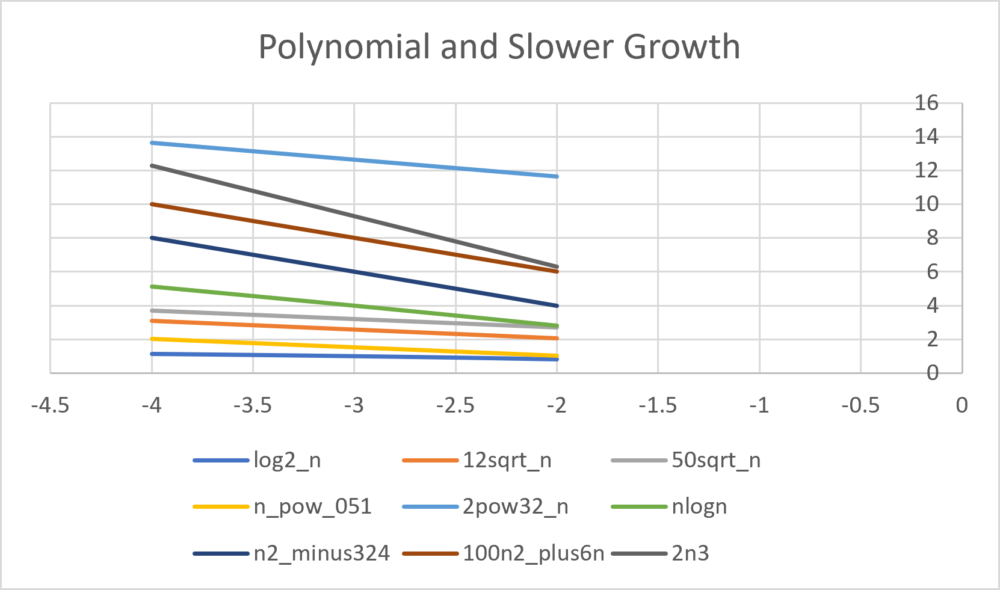
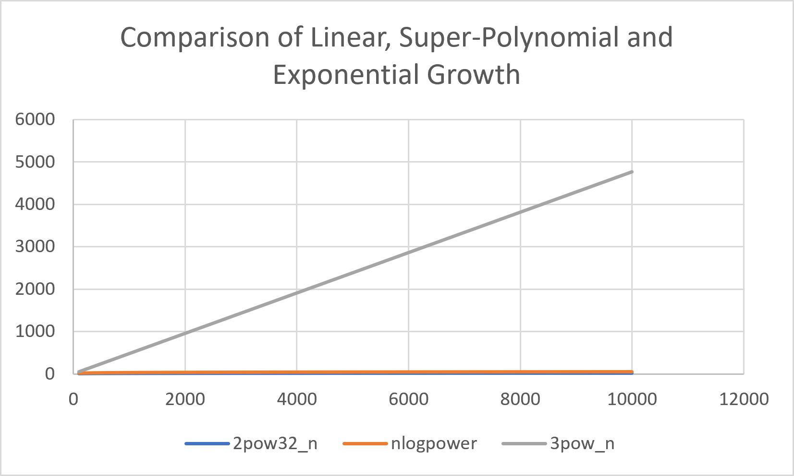
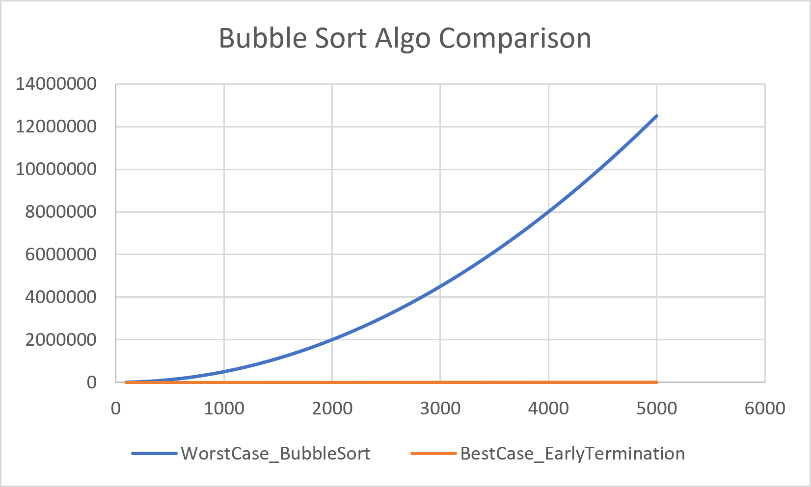
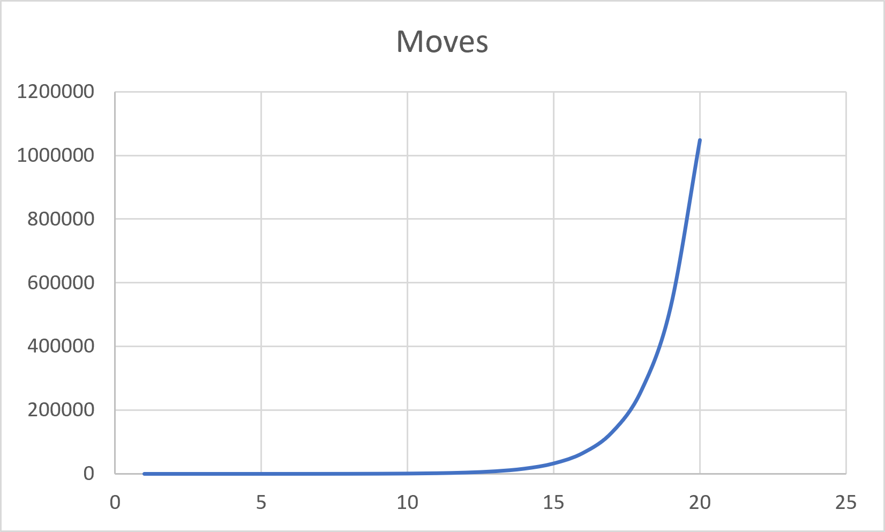

# DAA Laboratory – Assignment 1  


This repository contains the C programs developed as part of the **Design and Analysis of Algorithms (DAA) Laboratory**. Each program demonstrates a fundamental algorithmic concept, along with its implementation, complexity analysis, and (where applicable) graphical visualization using CSV files and Microsoft Excel.

---

# Student Information

| Field | Details |
|-------|---------|
| **Name** | Preetika Mishra |
| **Branch** | Computer Science & Engineering |
| **Semester** | 3rd Semester |
| **Subject** | Design and Analysis of Algorithms Lab |
| **Institute** | IIIT Bhubaneswar |

---

# Repository Structure

```
LAB 1│
├── Code Solutions
│   ├── Q1_FunctionGraph.c
│   ├── Q2_CoinSimulation.c
│   ├── Q3_BubbleSort.c
│   ├── Q4_TOH.c
│   ├── Q5_PartitionPoint.c
│   └── Q6_ElementUniqueness.c
│
├── csv files
│   ├── growth_order.csv
│   ├── coin_simulation.csv
│   ├── bubble_sort_analysis.csv
│   ├── tower_of_hanoi.csv
│   └── duplicate_analysis.csv
│
├── graphs
│   ├── graph_Q1.c
│   ├── graph_Q3.c
│   ├── graph_Q4.c
│   ├── graph_11.png
│   ├── graph_12.png
│   ├── graph3.png
│   ├── graph_4.png
│   ├── q1_growth.csv
│   ├── q3_bubble.csv
│   └── q4_toh.csv
│
├── README.md
```

---

# Assignment Solutions

---

## Question 1 — Ordering Functions by Growth Rate

### Objective

Arrange the given mathematical functions in increasing order of asymptotic growth using both numerical approximation and theoretical analysis.

### Concepts Used

- Asymptotic Analysis
- Merge Sort
- Numerical Evaluation
- Logarithmic Transformation

### Output

- Numerical ordering of functions
- Theoretical asymptotic ordering
- Growth comparison graph

### Graphs

### Polynomial and Logarithmic Growth Functions  

<p align="center">

</p>

### Higher Order Growth Functions  

<p align="center">

</p>

---

## Question 2 — Coin Toss Simulation

### Objective

Simulate

- Fair Coin
- Biased Coin

Estimate the probability of obtaining **Head** after repeated tosses.

### Concepts Used

- Random Number Generation
- Probability Estimation
- Experimental Analysis

### Output

- Estimated probability of Heads
- CSV file for plotting convergence    

CSV output records the estimated probability after every toss, allowing convergence of experimental probability to be visualized.

---

## Question 3 — Bubble Sort Analysis

### Objective

Compare the number of comparisons performed by the standard Bubble Sort and the optimized Bubble Sort with Early Termination.  

### Concepts Used

- Bubble Sort
- Optimized Bubble Sort  
- Experimental Comparison  

### Time Complexity

| Case | Complexity |
|------|------------|
| Best Case | O(n) |
| Average Case | O(n²) |
| Worst Case | O(n²) |

### Graph

<p align="center">

</p>

---

## Question 4 — Tower of Hanoi

### Objective

Implement the recursive solution for the Tower of Hanoi problem and analyze its exponential growth in terms of the number of disks.  

### Concepts Used

- Recursion
- Divide and Conquer

### Time Complexity

**O(2ⁿ)**

### Graph

<p align="center">

</p>

---

## Question 5 — Partition Point

### Objective

Locate the partition (transition) point in a sorted binary array using Binary Search.  

### Concepts Used

- Binary Search
- Divide and Conquer

### Time Complexity

**O(log n)**

---

## Question 6 — Element Uniqueness

### Objective

Determine whether all elements of an array are distinct using a Divide and Conquer approach based on Merge Sort.  

### Concepts Used

- Divide and Conquer
- Merge Sort
- Duplicate Detection

### Time Complexity

**O(n log n)**

---

# Complexity Summary

| Question | Algorithm / Technique              | Complexity |
| -------- | ---------------------------------- | ---------- |
| Q1       | Merge Sort based Function Ordering | O(F log F) |
| Q2       | Coin Toss Simulation               | O(n)       |
| Q3       | Bubble Sort Comparison             | O(n²)      |
| Q4       | Tower of Hanoi                     | O(2ⁿ)      |
| Q5       | Binary Search                      | O(log n)   |
| Q6       | Merge Sort + Divide & Conquer      | O(n log n) |


---

# Graph Generation

Graph data is generated in CSV format by the graph programs. The CSV files are included in the repository and can also be regenerated by executing the corresponding graph generation programs.

| Program | Output |
|---------|--------|
| graph_Q1.c | q1_growth.csv |
| graph_Q3.c | q3_bubble.csv |
| graph_Q4.c | q4_toh.csv |

The generated CSV files can be imported into **Microsoft Excel** to create line/scatter plots for performance analysis.

---

# How to Compile

Compile using GCC.

```bash
gcc "Code Solutions/Q1_FunctionGraph.c" -o Q1 -lm
gcc "Code Solutions/Q2_CoinSimulation.c" -o Q2
gcc "Code Solutions/Q3_BubbleSort.c" -o Q3
gcc "Code Solutions/Q4_TOH.c" -o Q4
gcc "Code Solutions/Q5_PartitionPoint.c" -o Q5
gcc "Code Solutions/Q6_ElementUniqueness.c" -o Q6
```

---  

## Running the Programs

Execute the compiled programs as follows:

```bash
./Q1
./Q2
./Q3
./Q4
./Q5
./Q6
```
---

The graph generation programs produce CSV files that can be imported into Microsoft Excel for plotting.

# Learning Outcomes

This laboratory assignment demonstrates the implementation and analysis of several fundamental algorithmic techniques, including:

- Asymptotic Growth Analysis
- Randomized Simulation
- Bubble Sort Optimization
- Recursive Algorithms
- Binary Search
- Divide and Conquer
- Merge Sort
- Experimental Performance Analysis

---

# Author

**Preetika Mishra**

ID B125086  

B.Tech – Computer Science & Engineering  

IIIT Bhubaneswar

---

*This repository was created as part of the Design and Analysis of Algorithms Laboratory coursework.*